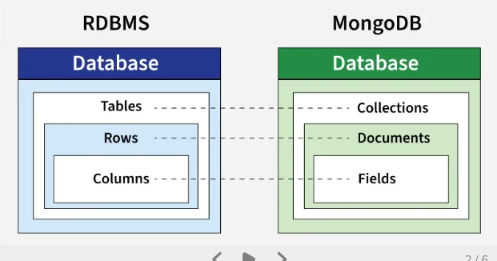

<h1 align="center">MongoDB Notes</h1>

- [Introduction:](#introduction)
  - [SQL VS NoSQL:](#sql-vs-nosql)
  - [How a api code works:](#how-a-api-code-works)
- [CRUD Operation:](#crud-operation)
  - [Create(POST)](#createpost)
    - [insertOne():](#insertone)
    - [insertMany():](#insertmany)
  - [Read(GET)](#readget)
    - [find():](#find)
      - [cursor:](#cursor)
    - [findOne():](#findone)
    - [projection:](#projection)
    - [countDocuments():](#countdocuments)
    - [distinct():](#distinct)
    - [aggregate() and Pipeline:](#aggregate-and-pipeline)
      - [Common Aggregation Stages:](#common-aggregation-stages)
  - [Update( PATCH/PUT )](#update-patchput-)
    - [PATCH (partial update - recommended):](#patch-partial-update---recommended)
      - [updateOne():](#updateone)
      - [updateMany():](#updatemany)
      - [Patch Operators:](#patch-operators)
    - [PUT (Full Replace):](#put-full-replace)
      - [replaceOne():](#replaceone)
      - [findOneAndReplace():](#findoneandreplace)
  - [Delete(DELETE)](#deletedelete)
    - [deleteOne():](#deleteone)
    - [deleteMany():](#deletemany)
    - [findOneAndDelete():](#findoneanddelete)
- [bulkWrite():](#bulkwrite)
- [Query Operators:](#query-operators)
  - [Comparison:](#comparison)
  - [Logical:](#logical)
  - [Evaluation:](#evaluation)
- [Update Operators:](#update-operators)
  - [Fields:](#fields)
  - [Array:](#array)
- [Others:](#others)
  - [Difference Between req.body, req.params and req.query:](#difference-between-reqbody-reqparams-and-reqquery)


# Introduction:
MongoDB is a NoSQL document based DBMS that stores data flexibly in BSON format instead of traditional SQL relational databases with tables and rows format. Unlike traditional relational databases that use tables and rows, MongoDB stores data as documents within collections and supports flexible schemas, allowing developers to evolve data structures over time.

## SQL VS NoSQL:
In the context of MongoDB, a document is basically a single record in a collection, similar to a row in a SQL database.

```
SQL                      MongoDB
------------------       -------------------
Database                 Database
  └── Table                └── Collection
        └── Row                  └── Document
              └── Column               └── Field
```



SQL:
```
Users Table
-----------
id | name | email
```

MongoDB:
```
{
  "_id": "123",
  "name": "John",
  "email": "john@example.com"
}

s
{
  "_id": "123",
  "name": "John",
  "orders": [
    { "product": "Laptop", "price": 1000 }
  ]
}
```


| Feature       | SQL (Relational DB)     | NoSQL (MongoDB)         |
| ------------- | ----------------------- | ----------------------- |
| Structure     | Tables (rows & columns) | Collections (documents) |
| Schema        | Fixed                   | Flexible                |
| Relationships | Strong (JOINs)          | Weak / manual           |


## How a api code works:

```js
app.post('/users', async (req, res) => {
    const user = req.body;
    const result = await usersCollection.insertOne(user);
    res.send(result); 
});
```

here,
- `app.post('/users'.......)`: 
  - `app` is a variable that contains express object (const app = express()).
  - `.post()` is a methods of the app object
  - `'/users'` is a endPoint(URL path). When the client sends a POST request to /users, this code runs.

- `async/await`: 
  - `async` marks the function as asynchronous so you can use await inside it.
  - `await` works same like .then(), it's pause the async function until the promise if resolved.
  
- `(req, res) => {...}`: this is a anonymous arrow function that contains two parameters: 
  - req = request object containing data from the client (req.body, req.params, req.query)
  - res = response object used to send data back to the client (res.json(), res.send(), res.status())

so we can do the same things using .then():

```js
app.post('/users', (req, res) => {
    const user = req.body;
    usersCollection.insertOne(user)
    .then(result => res.send(result))
});

```

**Note:**

In the frontend we need two .then(), because fetch() returns a response object, and you must convert it using .json() before using in the your code.

```js
fetch('api')
.then(res => res.json())
.then(data => console.log(data))
```

But in mongodb methods are already return js object when their promises resolve. So inside express we don't need to use res.json(), we can directly send the object using res.send().


# CRUD Operation:

| Operation  | HTTP Method   | Meaning          |
| ---------- | ------------- | ---------------- |
| **Create** | `POST`        | Add new document |
| **Read**   | `GET`         | Fetch document   |
| **Update** | `PUT / PATCH` | Modify document  |
| **Delete** | `DELETE`      | Remove document  |

- PUT = Replaces the entire document with the new data.
- PATCH = Updates only specific fields without touching others field of the document.


## Create(POST)

### insertOne():
Insert a single document

```js
app.post('/users', async (req, res) => {
    const user = req.body;
    const result = await usersCollection.insertOne(user);
    res.send(result); 
});
```

Note: Often we do lots of custom operation inside it:

```js
// Create a single user with custom fields
app.post('/users', async (req, res) => {
    const user = req.body;

    // Generate custom fields
    user.createdAt = new Date();
    user.role = "user"; 

    const result = await usersCollection.insertOne(user);
    res.send(result);
});
```

### insertMany():
To insert multiple documents at once, use the insertMany() method. This method inserts an array of objects into the database.

```js
app.post('/users/bulk', async (req, res) => {
    const users = req.body; // array of objects
    const result = await usersCollection.insertMany(users);
    res.send(result);
});
```

## Read(GET)

### find(): 
Get all data:

```js
app.get('/users', async (req, res) => {
    const result = await usersCollection.find().toArray();
    res.send(result);
});
```

note: find() returns a **cursor**, so you need to use .toArray() methods to convert the cursor to array. 

#### cursor:
A cursor is an object that MongoDB returns when you run a query like find(). It does not immediately give all the data — instead, it gives a pointer to the result set. Because MongoDB may return thousands or millions of documents, so returning all at once could:
- use too much RAM
- slow your server
- cause performance issues

A cursor also allows you to do `limit()`, `sort()`, `skip()`, `forEach()`, `map()`, `toArray()`:
- `toArray`: 
Converts a cursor into a JavaScript array
```js
app.get('/users', async (req, res) => {

const users = await usersCollection.find()
console.log(users) // cursor

const result = await users.toArray();
console.log(result) // array
    
res.send(result);
});
```

- `limit()`:
Limit how many documents you want

```js
app.get('/users', async (req, res) => {
    const result = await usersCollection
        .find()
        .limit(10)
        .toArray();

    res.send(result);
});
```

- `skip()`:


```js
app.get('/users', async (req, res) => {
    const page = parseInt(req.query.page); // http://localhost:3000/users?page=${page}
    const limit = 5;
    const skip = (page - 1) * limit;

    const result = await usersCollection
        .find()
        .skip(skip)
        .limit(limit)
        .toArray();

    res.send(result);
});
```
Page 1 → skip 0
Page 2 → skip first 5
Page 3 → skip first 10

- `sort()`:
Sort documents by a field

```js
app.get('/users', async (req, res) => {
    const result = await usersCollection
        .find()
        .sort({ createdAt: -1 })   // -1 = descending, 1 = ascending
        .toArray();

    res.send(result);
});
```


- `forEach()`:
Iterate each element with no return:

```js
app.get('/users', async (req, res) => {
    const cursor = usersCollection.find();

    const users = [];
    await cursor.forEach(user => {
        users.push(user.name);
    });

    res.send(users);
});
```

- `map()`:
Iterate each element and returns a new cursor, not an array..

```js
app.get('/users/names', async (req, res) => {
    const cursor = usersCollection.find();

    const result = await cursor.map(user => {
        return {
            id: user._id,
            name: user.name,
        };
    }).toArray();

    res.send(result);
});
```
### findOne():
Get a single item by ID:

```js
app.get('/users/:id', async (req, res) => {
    const id = req.params.id;
    const query = { _id: new ObjectId(id) };
    const result = await usersCollection.findOne(query);
    res.send(result);
});
```

### projection:
Both find methods accept a second parameter called projection. This parameter is an object that describes which fields to include in the results. 

```js
app.get('/users', async (req, res) => {
    const result = await usersCollection.find({}, {title: 1, date: 1});
    res.send(result);
});
```

Note: 1 means to include a field and 0 to exclude a field.

### countDocuments():
returns a number after Counting matching documents

```js
app.get('/users', async (req, res) => {
    const role = req.query.role; // GET http://localhost:3000/users?role=user
    const total = await usersCollection.countDocuments({ role });
    res.send( total );
});
```

### distinct():
Returns an array of unique values of a specific field/key:

```js
// GET /users/roles
app.get('/users/roles', async (req, res) => {
    const roles = await usersCollection.distinct("role");
    res.send( roles );
});
```

### aggregate() and Pipeline:
- aggregate() is a method used to process data through a pipeline. Its returns a cursor.
- A pipeline is an array of stages. Each step in the pipeline is called a stage. Each stage processes the documents and passes them to the next stage.

Note: Each stage starts with $ and the full array we called it pipeline

```js
db.collection.aggregate([
  { $stage1: { ... } },
  { $stage2: { ... } },
  ...
])
```


Common Aggregation Operators:

| Operator                   | Purpose                    |
| -------------------------- | -------------------------- |
| `$sum`                     | Sum values                 |
| `$avg`                     | Average value              |
| `$min`                     | Minimum value              |
| `$max`                     | Maximum value              |
| `$first`                   | First value in group       |
| `$last`                    | Last value in group        |
| `$push`                    | Add value to array         |
| `$addToSet`                | Add unique values to array |
| `$concat`                  | Concatenate strings        |
| `$substr`                  | Substring                  |
| `$gte`, `$lte`, `$eq` etc. | Comparison operators       |
| `$cond`                    | Conditional expression     |

Note: MongoDB has lots of operators,

```js
// Arithmetic & Statistical:
$sum, $avg, $min, $max, $first, $last, $stdDevPop, $stdDevSamp

// String Operators:
$concat, $substr, $substrBytes, $substrCP, $toUpper, $toLower, $trim, $split, $indexOfBytes, $indexOfCP

// Array Operators
$push, $addToSet, $size, $filter, $map, $reduce, $arrayElemAt, $concatArrays, $slice, $reverseArray, $indexOfArray

// Conditional & Comparison Operators:
$cond, $ifNull, $eq, $ne, $gt, $gte, $lt, $lte, $and, $or, $not, $switch

// Type Conversion Operators:
$toInt, $toDouble, $toString, $type, $convert, $round, $trunc, $floor, $ceil
```

#### Common Aggregation Stages:

- $match - Filters documents  

```js
app.get('/users/adults', async (req, res) => {
  const adults = await usersCollection.aggregate([
    { $match: { age: { $gte: 18 } } }
  ]).toArray();
  res.send(adults);
});
```
Explanation: Only returns users whose age is 18 or greater.

Input:
```
[
  { name: "Alice", age: 25 },
  { name: "Bob", age: 16 },
  { name: "Charlie", age: 30 }
]
```
Output:
```
[
  { name: "Alice", age: 25 },
  { name: "Charlie", age: 30 }
]
```

- $group - Groups documents and performs aggregations

```js
app.get('/users/city-count', async (req, res) => {
  const cityCounts = await usersCollection.aggregate([
    { $group: { _id: "$city", totalUsers: { $sum: 1 } } }
  ]).toArray();
  res.send(cityCounts);
});
```
Explanation: Groups users by city and counts how many users are in each city.

Input:
```
[
  { name: "Alice", city: "New York" },
  { name: "Bob", city: "London" },
  { name: "Charlie", city: "New York" },
  { name: "David", city: "Tokyo" }
]
```

Output:
```
[
  { _id: "New York", totalUsers: 2 },
  { _id: "London", totalUsers: 1 },
  { _id: "Tokyo", totalUsers: 1 }
]
```

Example 2: 

```js
app.get('/orders/total-revenue', async (req, res) => {
  const revenue = await ordersCollection.aggregate([
    { $group: { _id: null, totalRevenue: { $sum: "$amount" } } }
  ]).toArray();
  res.send(revenue);
});
```
Explanation: Sums all order amounts to get total revenue.

Input: 
```
[
  { orderId: 1, amount: 100 },
  { orderId: 2, amount: 200 },
  { orderId: 3, amount: 150 }
]
```
Output:
```
[
  { _id: null, totalRevenue: 450 }
]
```

Example 2: 

```js
app.get('/users/average-age', async (req, res) => {
  const avgAge = await usersCollection.aggregate([
    { $group: { _id: null, averageAge: { $avg: "$age" } } }
  ]).toArray();
  res.send(avgAge);
});
```
Explanation: Calculates the average age of all users (25 + 30 + 20) / 3 = 25.

Input:
```
[
  { name: "Alice", age: 25 },
  { name: "Bob", age: 30 },
  { name: "Charlie", age: 20 }
]
```
Output:
```
[
  { _id: null, averageAge: 25 }
]
```

Example 3:

```js
app.get('/users/age-range', async (req, res) => {
  const ageRange = await usersCollection.aggregate([
    { $group: { 
        _id: null, 
        maxAge: { $max: "$age" },
        minAge: { $min: "$age" }
    } }
  ]).toArray();
  res.send(ageRange);
});
```
Explanation: Finds the oldest (30) and youngest (20) user ages.

Input: 
```
[
  { name: "Alice", age: 25 },
  { name: "Bob", age: 30 },
  { name: "Charlie", age: 20 }
]
```
Output:
```
[
  { _id: null, maxAge: 30, minAge: 20 }
]
```

Example 4: 

```js
app.get('/cities/users-list', async (req, res) => {
  const cityUsers = await usersCollection.aggregate([
    { $group: { 
        _id: "$city", 
        userNames: { $push: "$name" }
    } }
  ]).toArray();
  res.send(cityUsers);
});
```
Explanation: Groups users by city and creates an array of user names for each city.

Input: 
```
[
  { name: "Alice", city: "New York" },
  { name: "Bob", city: "London" },
  { name: "Charlie", city: "New York" }
]
```
Output:
```
[
  { _id: "New York", userNames: ["Alice", "Charlie"] },
  { _id: "London", userNames: ["Bob"] }
]
```

- $project - Selects or reshapes fields

```js
app.get('/users/names', async (req, res) => {
  const names = await usersCollection.aggregate([
    { $project: { name: 1, age: 1, _id: 0 } }
  ]).toArray();
  res.send(names);
});
```
Explanation: Returns only name and age fields, excludes _id and city.

Input: 
```
[
  { _id: 1, name: "Alice", age: 25, city: "New York" },
  { _id: 2, name: "Bob", age: 30, city: "London" }
]
```

Output:
```
[
  { name: "Alice", age: 25 },
  { name: "Bob", age: 30 }
]
```
- $sort - Sorts documents

```js
app.get('/users/sorted', async (req, res) => {
  const sorted = await usersCollection.aggregate([
    { $sort: { age: -1 } }  // -1 = descending, 1 = ascending
  ]).toArray();
  res.send(sorted);
});
```
Explanation: Sorts users by age in descending order (oldest first).

Input:
```
[
  { name: "Alice", age: 25 },
  { name: "Bob", age: 30 },
  { name: "Charlie", age: 20 }
]
```
Output:
```
[
  { name: "Bob", age: 30 },
  { name: "Alice", age: 25 },
  { name: "Charlie", age: 20 }
]
```
- $limit - Limits the number of documents

```js
app.get('/users/top-3', async (req, res) => {
  const topUsers = await usersCollection.aggregate([
    { $sort: { age: -1 } },
    { $limit: 3 }
  ]).toArray();
  res.send(topUsers);
});
```
Explanation: Returns only the top 3 oldest users.

Input:
```
[
  { name: "Alice", age: 25 },
  { name: "Bob", age: 30 },
  { name: "Charlie", age: 20 },
  { name: "David", age: 35 },
  { name: "Eve", age: 28 }
]
``` 
Output:
```
[
  { name: "David", age: 35 },
  { name: "Bob", age: 30 },
  { name: "Eve", age: 28 }
]
```
- $skip - Skips a number of documents (used for pagination)

```js
app.get('/users/page-2', async (req, res) => {
  const page2 = await usersCollection.aggregate([
    { $skip: 2 },
    { $limit: 2 }
  ]).toArray();
  res.send(page2);
});
```
Explanation: Skips the first 2 documents and returns the next 2 (pagination).

Input:
```
[
  { name: "Charlie" },
  { name: "David" }
]
```
Output:
```
[
  { name: "Charlie" },
  { name: "David" }
]
```
- $unwind - Deconstructs an array into separate documents

```js
app.get('/users/hobbies', async (req, res) => {
  const hobbies = await usersCollection.aggregate([
    { $unwind: "$hobbies" }
  ]).toArray();
  res.send(hobbies);
});
```
Explanation: Creates a separate document for each hobby in the array.

Input:
```
[
  { name: "Alice", hobbies: ["reading", "gaming"] },
  { name: "Bob", hobbies: ["swimming"] }
]
```
Output:
```
[
  { name: "Alice", hobbies: "reading" },
  { name: "Alice", hobbies: "gaming" },
  { name: "Bob", hobbies: "swimming" }
]
```

- $lookup - Performs a LEFT JOIN with another collection

```js
app.get('/users/orders', async (req, res) => {
  const usersWithOrders = await usersCollection.aggregate([
    { $lookup: {
        from: "ordersCollection",
        localField: "_id",
        foreignField: "userId",
        as: "ordersHistory"
    } }
  ]).toArray();
  res.send(usersWithOrders);
});
```

Explanation: Joins users with their orders from the orders collection.

Users Collection:
```
[
  { _id: 1, name: "Alice" },
  { _id: 2, name: "Bob" }
]
``` 
Orders Collection:
```
[
  { orderId: 101, userId: 1, product: "Laptop" },
  { orderId: 102, userId: 1, product: "Mouse" },
  { orderId: 103, userId: 2, product: "Keyboard" }
]
```
Output:
```
[
  {
    _id: 1,
    name: "Alice",
    ordersHistory: [
      { orderId: 101, userId: 1, product: "Laptop" },
      { orderId: 102, userId: 1, product: "Mouse" }
    ]
  },
  {
    _id: 2,
    name: "Bob",
    ordersHistory: [
      { orderId: 103, userId: 2, product: "Keyboard" }
    ]
  }
]
```
- $addFields - Adds new fields to documents

```js
app.get('/users/adult-flag', async (req, res) => {
  const users = await usersCollection.aggregate([
    { $addFields: { isAdult: { $gte: ["$age", 18] } } }
  ]).toArray();
  res.send(users);
});
```

Explanation: Adds a new isAdult field that checks if age >= 18.

Input:
```
[
  { name: "Alice", age: 25 },
  { name: "Bob", age: 16 },
  { name: "Charlie", age: 18 }
]
```
Output:
```
[
  { name: "Alice", age: 25, isAdult: true },
  { name: "Bob", age: 16, isAdult: false },
  { name: "Charlie", age: 18, isAdult: true }
]
```
- $count - Counts the number of documents

```js
app.get('/users/count', async (req, res) => {
  const result = await usersCollection.aggregate([
    { $match: { age: { $gte: 18 } } },
    { $count: "adultCount" }
  ]).toArray();
  res.send(result);
});
```
Explanation: Counts how many users have age >= 18.

Input:
```
[
  { name: "Alice", age: 25 },
  { name: "Bob", age: 16 },
  { name: "Charlie", age: 30 }
]
```
Output:
```
[
  { adultCount: 2 }
]
```
- $facet - Performs multiple aggregations in parallel

```js
app.get('/users/stats', async (req, res) => {
  const stats = await usersCollection.aggregate([
    { $facet: {
        "ageStats": [
          { $group: { _id: null, avgAge: { $avg: "$age" } } }
        ],
        "cityStats": [
          { $group: { _id: "$city", count: { $sum: 1 } } }
        ]
    } }
  ]).toArray();
  res.send(stats);
});
```
Explanation: Runs two different aggregations at the same time - one for age stats and one for city stats.

Input: 
```
[
  { name: "Alice", age: 25, city: "New York" },
  { name: "Bob", age: 30, city: "London" },
  { name: "Charlie", age: 20, city: "New York" }
]
```
Output:
```
[
  {
    ageStats: [{ _id: null, avgAge: 25 }],
    cityStats: [
      { _id: "New York", count: 2 },
      { _id: "London", count: 1 }
    ]
  }
]
```

## Update( PATCH/PUT )

### PATCH (partial update - recommended):

#### updateOne():

```js
app.patch('/users/:id', async (req, res) => {
    const id = req.params.id;
    const updatedData = req.body;

    const result = await usersCollection.updateOne(
        { _id: new ObjectId(id) },
        { $set: updatedData }
    );

    res.send(result);
});
```

#### updateMany():

```js
app.patch('/users/update-city', async (req, res) => {
    const { oldCity, newCity } = req.body;

    const result = await usersCollection.updateMany(
        { city: oldCity },      // find condition
        { $set: { city: newCity } } // update operation
    );

    res.send(result);
});
```

#### Patch Operators:

- $inc: Use when you want to increase or decrease a number on the document field:

```js
app.patch('/users/add-balance/:id', async (req, res) => {
    const id = req.params.id;

    const result = await usersCollection.updateOne(
        { _id: new ObjectId(id) },
        { $inc: { balance: 100 } } // for decrease use -100
    );

    res.send(result);
});
```

- $push: Use to add an item from an array in a document field:

```js
app.patch('/users/hobby/:id', async (req, res) => {
    const id = req.params.id;
    const hobby = req.body.hobby;

    const result = await usersCollection.updateOne(
        { _id: new ObjectId(id) },
        { $push: { hobbies: hobby } }
    );

    res.send(result);
});
```
- $pull: Use to remove an item from an array in a document field:

```js
app.patch('/users/hobby-remove/:id', async (req, res) => {
    const id = req.params.id;
    const hobby = req.body.hobby;

    const result = await usersCollection.updateOne(
        { _id: new ObjectId(id) },
        { $pull: { hobbies: cricket } } 
    );

    res.send(result);
});
```
- $unset: Use to Remove a Field in the document:

```js
app.patch('/users/remove-age/:id', async (req, res) => {
    const id = req.params.id;

    const result = await usersCollection.updateOne(
        { _id: new ObjectId(id) },   // find user
        { $unset: { age: "" } }      // remove the field 
    );

    res.send(result);
});
```
Note: The value of the field inside $unset doesn’t matter ("", null, 1) — anything works

- $upsert: Used to update a document if it exists, or create a new document if it does not exist. The new document will include:
- The fields from the filter (query)
- The fields from the update operation (e.g., $set)

```js
app.patch('/users/:email', async (req, res) => {
    const email = req.params.email;
    const updatedFields = req.body;

    const result = await usersCollection.updateOne(
        { email: email },        // find user by email
        { $set: updatedFields }, // update only provided fields
        { upsert: true }         // create if not exist
    );

    res.send(result);
});
```

### PUT (Full Replace):

#### replaceOne(): 

Removed missing fields

```js
app.put('/users/:id', async (req, res) => {
    const id = req.params.id;
    const newData = req.body;

    const result = await usersCollection.replaceOne(
        { _id: new ObjectId(id) },
        newData
    );

    res.send(result);
});
```
#### findOneAndReplace():
Replace a document and return it

```js
app.put('/users/replace/:id', async (req, res) => {
    const id = req.params.id;
    const newUserData = req.body;

    const result = await usersCollection.findOneAndReplace(
        { _id: new ObjectId(id) },   // find document
        newUserData,                 // completely replace with this
        { returnDocument: 'after' }  // return the replaced document
    );

    res.send(result);
});
```

## Delete(DELETE)

### deleteOne():
delete a specific document.

```js
app.delete('/users/:id', async (req, res) => {
    const id = req.params.id;

    const result = await usersCollection.deleteOne({ _id: new ObjectId(id) });

    res.send(result);
});
```

### deleteMany():
delete multiple items.

```js
app.delete('/users', async (req, res) => {
    const { role } = req.query;
    const result = await usersCollection.deleteMany({ role });
    res.send(result);
});
```

### findOneAndDelete():
Delete a single document that matches a filter and return the deleted document.

```js
app.delete('/users/:email', async (req, res) => {
    const email = req.params.email; // filter

    const result = await usersCollection.findOneAndDelete(
        { email: email }  
    );

    res.send(result);
});
```

# bulkWrite():
bulkWrite() allows you to perform multiple write operations (insert/update/delete) operations at once:

```js
app.post('/users/bulk-update', async (req, res) => {
    const operations = [
        // Update role for all moderators
        { updateMany: { 
            filter: { role: "moderator" }, 
            update: { $set: { role: "senior-moderator" } } 
        }},

        // Update role for a specific user
        { updateOne: { 
            filter: { email: "user1@gmail.com" }, 
            update: { $set: { role: "admin" } } 
        }},

        // Delete inactive users
        { deleteMany: { filter: { status: "inactive" } } }
    ];

    const result = await usersCollection.bulkWrite(operations);

    res.send(result);
});
```

# Query Operators: 
There are many query operators that can be used to compare and reference document fields.

## Comparison:
The following operators can be used in queries to compare values:

- $eq: Values are equal
- $ne: Values are not equal
- $gt: Value is greater than another value
- $gte: Value is greater than or equal to another value
- $lt: Value is less than another value
- $lte: Value is less than or equal to another value
- $in: Value is matched within an array

## Logical:
The following operators can logically compare multiple queries.

- $and: Returns documents where both queries match
- $or: Returns documents where either query matches
- $nor: Returns documents where both queries fail to match
- $not: Returns documents where the query does not match

## Evaluation:
The following operators assist in evaluating documents.

- $regex: Allows the use of regular expressions when evaluating field values
- $text: Performs a text search
- $where: Uses a JavaScript expression to match documents

# Update Operators: 
There are many update operators that can be used during document updates.

## Fields:
The following operators can be used to update fields:
- $currentDate: Sets the field value to the current date
- $inc: Increments the field value
- $rename: Renames the field
- $set: Sets the value of a field
- $unset: Removes the field from the document

## Array:
The following operators assist with updating arrays.

- $addToSet: Adds distinct elements to an array
- $pop: Removes the first or last element of an array
- $pull: Removes all elements from an array that match the query
- $push: Adds an element to an array

# Others: 
## Difference Between req.body, req.params and req.query:

- req.body → used when we need requested body info:

Frontend:

```js
fetch('http://localhost:3000/users', {
  method: 'POST',
  headers: { 
    'content-type': 'application/json' 
  },
  body: JSON.stringify({ name: "Tamim", email: "a@a.com" })
})
```

Backend: 

```js
app.post('/users', async (req, res) => {
    const newUser = req.body;
    console.log(newUser) // { name: "Tamim", email: "a@a.com" }
    const result = await usersCollection.insertOne(newUser);
    res.send(result); 
});
```

- req.params → used when we need requested url dynamic url path:

```js
app.get('/users/:id', async (req, res) => {
    const id = req.params.id;
    const query = { _id: new ObjectId(id) };
    const result = await usersCollection.findOne(query);
    res.send(result);
});
```

- req.query → used when we need requested url part after ?

```js
app.get('/users', async (req, res) => {
    const page = parseInt(req.query.page); // http://localhost:3000/users?page=${page}
    const limit = 5;
    const skip = (page - 1) * limit;

    const result = await usersCollection
        .find()
        .skip(skip)
        .limit(limit)
        .toArray();

    res.send(result);
});
```


